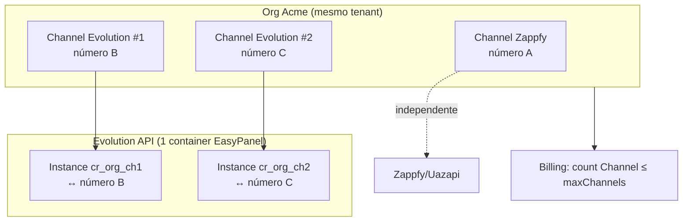
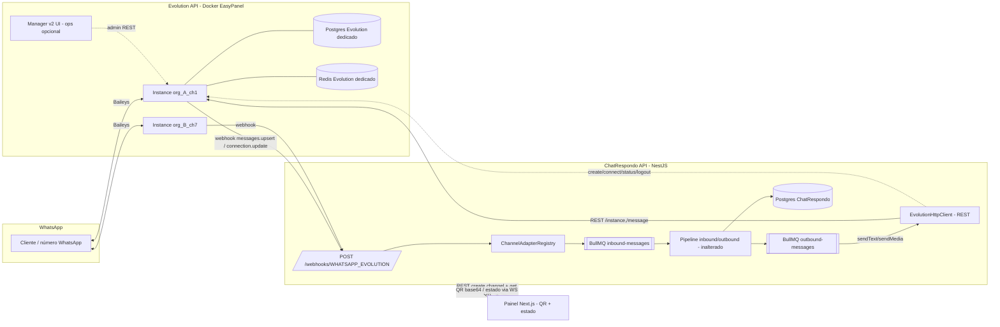

# Evolution API — Plano de Integração (ChatRespondo)

> **Para workers agênticos:** este é um **plano de implementação**, não código. A implementação deve seguir TDD (RED → GREEN → REFACTOR), commits frequentes e deploy incremental sem quebrar produção. Cada fase é entregável de forma independente. As tarefas usam checkbox (`- [ ]`) para tracking.

**Objetivo:** Adicionar um novo canal WhatsApp baseado em **Evolution API** (gateway Baileys self-hosted) ao ChatRespondo, reaproveitando 100% da arquitetura hexagonal de `channel-hub` (ports/adapters), sem alterar o pipeline de mensagens existente. **Canais existentes (Zappfy etc.) não são tocados** — Evolution é só mais uma opção no wizard.

**Arquitetura:** Evolution API (servidor) roda como serviço Docker próprio (EasyPanel/Contabo, atrás do Cloudflare). Opcionalmente Evolution Manager v2 (UI admin) ao lado. O ChatRespondo fala com a **API** via REST (criar instância, conectar QR, enviar) e recebe eventos via webhook (`messages.upsert`, `connection.update`, etc). Cada número WhatsApp = 1 *instance* Evolution = 1 `Channel` no ChatRespondo (isolamento por org via `organizationId`).

**Tech Stack:** NestJS + BullMQ + Prisma/Postgres + Redis (API), Next.js (painel), **Evolution API v2** (Docker) + **Evolution Manager v2** (UI ops, opcional), EasyPanel + Cloudflare Tunnel + Contabo VPS (infra).

**Epic Jira:** pendente — MCP Atlassian retornou `403 The app is not installed on this instance` (cloud `a11c31be-…` / `martstudiosbr.atlassian.net`). Stories S0–S6 prontas na §10 para criação manual. Labels: `chatrespondo`, `evolution-api`.

---

## 0. Decisões travadas (2026-07-20)

| # | Tema | Decisão |
|---|------|---------|
| 1 | Baileys vs Cloud API | **Evolution com motor Baileys** como canal **aditivo**. Usuário confirmou entendimento (Baileys ≠ Cloud API oficial). Não migrar nem alterar Zappfy/`WHATSAPP_OFFICIAL`. Cloud API oficial continua no canal já existente. |
| 2 | 1 número = 1 instance | **Sim.** Cada `Channel` tipo `WHATSAPP_EVOLUTION` = 1 instance Evolution = 1 número. Org pode ter **N** canais (Zappfy + Evolution + …) até `maxChannels` do plano. Novo canal = novo número. |
| 3 | Zappfy lado a lado | **Confirmado.** Evolution e Zappfy são canais independentes na mesma org. |
| 4 | Grupos WhatsApp | ✅ **MVP = sim** (usuário: “Sim”). Ordem: **1:1 primeiro (S3)**, depois **grupos inbound + outbound na mesma onda MVP (S4)**, **antes** do hardening (S6). Não adiar para pós-MVP. |
| 5 | Hosting | **Mesmo Contabo / EasyPanel** (serviço dedicado Evolution). |
| 6 | Importar histórico ao conectar | **Sim** — Phase 3 / S5 (deixa de ser só “opcional”). |
| 7 | Postgres/Redis da Evolution | **Dedicados** (não compartilhar com ChatRespondo). |

**Stack a deployar (clarificação do repo linkado):**

| Peça | O que é | Deploy? |
|------|---------|---------|
| **Evolution API** ([EvolutionAPI/evolution-api](https://github.com/EvolutionAPI/evolution-api)) | Servidor Node que conecta WhatsApp (Baileys), expõe REST + webhooks | **Sim — obrigatório** |
| **Evolution Manager v2** ([evolution-foundation/evolution-manager-v2@3137df4](https://github.com/evolution-foundation/evolution-manager-v2/tree/3137df469504ce211c68e7b35f0706497ac1b95f)) | UI React/Vite/Tailwind para **administrar** a API (instâncias, chatbots, webhooks). **Não** substitui o painel ChatRespondo nem a API | **Opcional** — útil no spike (S0) e ops; restringir com basic auth / IP allowlist |

> O Manager v2 **exige** uma Evolution API já rodando (`VITE_EVOLUTION_API_URL` + API key). ChatRespondo integra com a **API**, não com o Manager.

### Modelo multi-número (confirmado)



**Resposta direta:** sim — ao adicionar um **novo** canal Evolution, a org ganha **outro** número (outra instance). Pode terminar com vários números no total (misturando Zappfy + Evolution), cada um com instance própria, limitado por `maxChannels`.

---

## 1. Objetivo e Não-objetivos

### Objetivo
- Oferecer um canal WhatsApp **self-hosted gratuito** (sem taxa por número de provedores como Zappfy/Uazapi), com conexão via **QR Code**, envio/recebimento de mensagens (texto + mídia), status de entrega e isolamento multi-tenant.
- Integrar **de forma aditiva**: novo `ChannelType`, novo módulo de adapter. Zero alteração no core do pipeline (`inbound-message.processor`, `outbound-message.processor`, `webhook-gateway.controller`, billing, IA).

### Não-objetivos (fora deste plano)
- Substituir/migrar canais Zappfy existentes (Evolution roda **lado a lado**; migração é decisão posterior).
- Suportar WhatsApp Cloud API *através* da Evolution (o canal `WHATSAPP_OFFICIAL` já existe para isso).
- Envio de templates HSM (não se aplica a Baileys).
- Criptografia at-rest de segredos de canal (é dívida técnica pré-existente do modelo `Channel.config`; tratada como melhoria futura, ver §7).
- Multi-região / alta disponibilidade da Evolution (single-node no MVP).

---

## 2. Estado atual do stack de mensageria

O ChatRespondo **já tem** uma arquitetura hexagonal madura para canais. Evolution encaixa como mais um adapter.

### 2.1 Ports (contratos) — `chatrespondo-api/src/modules/channel-hub/ports/`
- `InboundChannelPort` — `extractLocators()`, `matchesChannel()`, `validateWebhook()`, `parseWebhook()`, `handleVerification?()`.
- `OutboundChannelPort` — `sendMessage()`, `sendTypingIndicator()`, `getMediaUrl()`, `downloadMedia()`, `resolveInboundMediaUrl?()`, `deleteMessage?()`, `getRateLimits()`.
- `HistorySyncPort` — `getSyncCapabilities()`, `fetchConversations()`, `fetchMessages()` (opcional).
- Tipos normalizados: `NormalizedInboundMessage`, `NormalizedOutboundMessage`, `StatusUpdate`, `WebhookParseResult`, `ChannelLocator`.

### 2.2 Registry — `channel-adapter.registry.ts`
Mapa `ChannelType → adapter`. Adapters se auto-registram no `onModuleInit` do `ChannelHubModule`.

### 2.3 Gateway de webhook — `webhook-gateway.controller.ts`
Endpoint único **`POST /api/v1/webhooks/:channelType`** (público, com `WebhookThrottleGuard`):
1. `extractLocators(payload, headers)` → identifica candidatos.
2. `channelsService.resolveByLocator()` + `adapter.matchesChannel()` → resolve o `Channel` (e a org).
3. `adapter.validateWebhook()` → autenticidade.
4. `webhookEvents.record()` → auditoria append-only (`webhook_events`).
5. `adapter.parseWebhook()` → normaliza → enfileira em `inbound-messages` (BullMQ).
   → **Nenhuma mudança necessária aqui.**

### 2.4 Pipeline inbound — `messaging/pipeline/inbound-message.processor.ts`
Idempotência (`claimProcessing`), resolve contato/conversa, `upsertMessage` (unique `(conversationId, externalId)`), trata *echo* (`fromMe`), dispara chatbot/IA (debounce 10s), watchdog, enrichment de contato. **Genérico — funciona com qualquer adapter.**

### 2.5 Pipeline outbound — `messaging/pipeline/outbound-message.processor.ts`
Fila `outbound-messages` → `registry.getOutbound(channel.type).sendMessage()` → persiste `externalId` → idempotência para reconciliar o echo. Humaniza (typing) mensagens de IA. **Genérico.**

### 2.6 Modelo de dados relevante (`prisma/schema.prisma`)
- `enum ChannelType { WHATSAPP_OFFICIAL, WHATSAPP_ZAPPFY, INSTAGRAM }` ← **precisa de `WHATSAPP_EVOLUTION`**.
- `Channel { organizationId, type, name, config Json, webhookSecret, isActive, ... }` — `config` guarda credenciais por provedor.
- `Contact` / `ContactChannel` (`@@unique([channelId, externalId])`), `Conversation`, `Message` (`@@unique([conversationId, externalId])`), `WebhookEvent`, `ChannelSyncJob`.

### 2.7 Canal análogo já existente: **Zappfy/Uazapi**
`adapters/zappfy/` é um gateway **Baileys** — praticamente idêntico em espírito à Evolution (instância, token, webhook `messages.upsert`, ack numérico, echo `fromMe`, mídia `.enc`). **É o blueprint direto para o adapter Evolution.** Arquivos-referência:
- `zappfy.http-client.ts`, `zappfy.inbound-adapter.ts`, `zappfy.outbound-adapter.ts`, `zappfy.message-mapper.ts`, `zappfy.sync-adapter.ts`, `zappfy-contact-enricher.service.ts`, `zappfy.module.ts`.

### 2.8 Billing/limites — `billing/plans.ts` + `plan-limits.service.ts`
`PLAN_CATALOG` define `maxChannels` por plano. `assertCanCreateChannel()` conta `Channel` (deletedAt null). **Como Evolution = `Channel`, já entra no limite automaticamente.**

### 2.9 UI de canais — `chatrespondo-web/src/features/channels/`
`create-channel-dialog.tsx` (wizard tipo → config), `channel-card.tsx`, `channels-list.tsx`. Suporta `webhookSecret`, mostra URL de webhook. Faltará: **fluxo de QR Code** (novo em relação aos canais atuais, que usam token/credencial).

---

## 3. Arquitetura proposta

### 3.0 Evolution API vs Manager v2 (pesquisa 2026-07-20)

O link [evolution-manager-v2@3137df4](https://github.com/evolution-foundation/evolution-manager-v2/tree/3137df469504ce211c68e7b35f0706497ac1b95f) é a **UI de administração**, não o servidor WhatsApp:

| | **Evolution API** | **Evolution Manager v2** |
|--|-------------------|--------------------------|
| Papel | Gateway WhatsApp (Baileys), REST, webhooks | Dashboard React para ops (instâncias, bots, métricas) |
| Stack | Node (Docker oficial Evolution) | React 18 + TypeScript + Vite + Radix/Tailwind |
| Quero no ChatRespondo? | **Sim — integração de produção** | **Opcional** — só para admin interno no EasyPanel |
| Usuário final vê? | Não (backend) | Não — o painel do produto continua sendo o ChatRespondo Next.js |

Deploy recomendado no Contabo/EasyPanel: **Evolution API + Postgres dedicado + Redis dedicado** (+ Manager v2 opcional atrás de auth).

### 3.1 Diagrama



### 3.2 Isolamento multi-tenant (decisão-chave — travada)

**Modelo recomendado: Evolution compartilhada + 1 instance por Channel, namespaced por org.**

- Um único serviço Evolution (Docker) atende **todas as orgs**.
- Cada número conectado = 1 *instance* Evolution = 1 `Channel` no ChatRespondo.
- `instanceName` = `cr_<orgId>_<channelId>` (curto, determinístico, sem PII). Vincula instância ↔ canal ↔ org de forma inequívoca.
- Cada instância tem sua própria **apikey** (retornada no create) — usada para envio e para validar o webhook inbound (igual ao `token` do Zappfy).
- O webhook da Evolution carrega `instance` no payload → `matchesChannel` casa `config.instanceName` → resolve org. **Sem vazamento cross-tenant.**

Por que não "1 container Evolution por org": custo operacional e desperdício de recursos (dezenas/centenas de containers), escalonamento inviável, deploy complexo. O isolamento por *instance* + apikey já é suficiente para o modelo de segurança atual (mesmo grau de isolamento que Zappfy).

---

## 4. Opções avaliadas

| # | Opção | Prós | Contras | Veredito |
|---|-------|------|---------|----------|
| **A** | **Evolution self-hosted compartilhada, 1 instance/canal** | Grátis (sem taxa/número); infra já é EasyPanel+Contabo+Cloudflare; controle total; mapeia 1:1 no modelo `Channel`; billing por `maxChannels` sem mudança; reaproveita blueprint Zappfy | Ops próprio (uptime, volume persistente, updates); risco de ban Baileys (não-oficial) | ✅ **Recomendado** |
| B | Evolution **gerenciada** (provedor pago) | Menos ops; SLA de terceiro | Custo recorrente; residência de dados/LGPD; lock-in; contradiz motivação (reduzir custo vs Zappfy) | ❌ |
| C | **1 container Evolution por org** | Isolamento físico máximo | Ops explode; não escala; deploy pesado; over-engineering (YAGNI) | ❌ |
| D | Não fazer nada (manter só Zappfy/Uazapi) | Zero esforço | Mantém custo por número; sem alternativa self-hosted; menos alavancagem comercial | ❌ |

**Recomendação:** **Opção A.** Alinha com a infra existente, elimina custo por número, e encaixa na arquitetura hexagonal com esforço baixo (blueprint Zappfy pronto).

---

## 5. Modelo de dados (Prisma)

### 5.1 Decisão: reutilizar `Channel` como a "Instance" (mínimo, recomendado)

O modelo atual já cobre 95% do necessário. Mudanças **mínimas e não-destrutivas**:

**5.1.1 Enum — adicionar valor (migration aditiva, sem risco):**
```prisma
enum ChannelType {
  WHATSAPP_OFFICIAL
  WHATSAPP_ZAPPFY
  WHATSAPP_EVOLUTION   // novo
  INSTAGRAM
}
```

**5.1.2 `Channel.config` (Json — sem migration) guarda o estado da instância:**
```jsonc
{
  "serverUrl": "https://evolution.internal",   // opcional; default = env EVOLUTION_SERVER_URL
  "instanceName": "cr_<orgId>_<channelId>",
  "apikey": "<per-instance apikey retornada no create>",
  "phoneNumber": "+55...",                       // preenchido no connection.update
  "profileName": "Loja X",
  "connectionState": "open|connecting|close",   // atualizado por webhook connection.update
  "lastConnectedAt": "2026-07-20T12:00:00Z"
}
```
> `config` já é a convenção do projeto (Zappfy usa `config.token`/`config.instanceId`; WA Official usa `config.phoneNumberId`). Manter o padrão evita divergência.

**5.1.3 Mapeamento de mensagens:** **nenhuma mudança.** `Message.externalId` = `key.id` da Evolution; `@@unique([conversationId, externalId])` já garante idempotência/merge do echo, exatamente como no Zappfy. `ContactChannel.externalId` = JID (`5511...@s.whatsapp.net` / `...@g.us`).

**5.1.4 Auditoria de webhooks:** reusa `WebhookEvent` (append-only) — sem mudança.

### 5.2 Alternativa avaliada: tabelas dedicadas `EvolutionInstance` / `ConnectionEvent`

Criar modelos próprios para lifecycle da instância e histórico de conexões.
- **Prós:** consultas de estado tipadas; auditoria rica de connect/disconnect; desacopla instância de canal.
- **Contras:** duplica o que `Channel` + `config` + `WebhookEvent` já fazem; migração maior; mais superfície para bug; contraria YAGNI.
- **Veredito:** ❌ para o MVP. **Opcional (Fase 4)**: adicionar uma tabela leve `ChannelConnectionEvent` **apenas se** o time quiser gráfico/auditoria de estabilidade de conexão:
  ```prisma
  model ChannelConnectionEvent {
    id        String   @id @default(cuid())
    channelId String   @map("channel_id")
    state     String   // open | connecting | close | qr
    reason    String?
    createdAt DateTime @default(now()) @map("created_at")
    channel   Channel  @relation(fields: [channelId], references: [id], onDelete: Cascade)
    @@index([channelId, createdAt(sort: Desc)])
    @@map("channel_connection_events")
  }
  ```

**Recomendação:** §5.1 (mínimo) no MVP; §5.2 opcional só na Fase 4 se houver demanda de observabilidade.

---

## 6. Fluxos

### 6.1 Conectar (QR)
1. Usuário no painel → "Novo canal" → **WhatsApp (Evolution)** → nome do canal → criar.
2. `channelsService.create()` → `assertCanCreateChannel()` (billing) → cria `Channel` (config com `instanceName` gerado).
3. **Provisionamento** (novo, análogo ao `configureZappfyWebhook`): API chama `EvolutionHttpClient.createInstance()`:
   - `POST {server}/instance/create` com `{ instanceName, integration: "WHATSAPP-BAILEYS", qrcode: true, webhook: { url: "<APP_URL>/api/v1/webhooks/WHATSAPP_EVOLUTION", byEvents: false, base64: true, events: ["MESSAGES_UPSERT","MESSAGES_UPDATE","SEND_MESSAGE","CONNECTION_UPDATE","QRCODE_UPDATED","CONTACTS_UPSERT"] } }` usando a **global API key** (`EVOLUTION_API_KEY`).
   - Guarda `apikey` da instância em `config.apikey`.
4. Painel obtém o QR: `GET /api/v1/channels/:id/qrcode` (proxy para `GET {server}/instance/connect/{instanceName}`) → base64. **Ou** via realtime: webhook `QRCODE_UPDATED` → `RealtimeGateway.emitToChannel(channelId, 'channel:qrcode', {...})`.
5. Usuário escaneia → Evolution dispara `CONNECTION_UPDATE state=open` → adapter atualiza `config.connectionState=open`, `phoneNumber`, `lastConnectedAt` → painel mostra "Conectado".

### 6.2 Receber mensagem
`MESSAGES_UPSERT` → gateway (`extractLocators` por `instance` + apikey header) → `matchesChannel` → `validateWebhook` → `parseWebhook` (`EvolutionMessageMapper.normalizeInbound`) → fila `inbound-messages` → **pipeline existente** (idempotência, contato/conversa, IA/chatbot, watchdog). Zero mudança no pipeline.

### 6.3 Enviar mensagem
Operador/IA → pipeline outbound → `registry.getOutbound(WHATSAPP_EVOLUTION).sendMessage()` → `EvolutionMessageMapper.denormalize()` → `POST {server}/message/sendText/{instance}` (ou `sendMedia`/`sendWhatsAppAudio`/`sendReaction`/`sendLocation`) com header `apikey` da instância → retorna `key.id` → persiste `externalId`. Echo (`SEND_MESSAGE`/`fromMe`) reconcilia via unique constraint (igual Zappfy).

### 6.4 Desconectar / reconectar
- `CONNECTION_UPDATE state=close` → `config.connectionState=close` → notifica painel + (opcional) `Notification`/Slack alert.
- Reconexão: `GET /instance/connect/{instance}` gera novo QR; painel oferece botão "Reconectar / Reescanear".
- **Logout explícito:** `DELETE /instance/logout/{instance}` (mantém instância) ou `DELETE /instance/delete/{instance}` (remove) no delete de canal.

### 6.5 Deletar canal
`channelsService.remove()` (soft-delete atual) + **fire-and-forget** `DELETE {server}/instance/delete/{instanceName}` para não deixar instância órfã consumindo recurso na Evolution.

---

## 7. Segurança

| Vetor | Medida |
|-------|--------|
| **Global API key da Evolution** | `EVOLUTION_API_KEY` + `EVOLUTION_SERVER_URL` em env do serviço API (nunca no `config` do canal, nunca no front). Só o backend cria/deleta instâncias. |
| **apikey por instância** | Retornada no `create` como `hash`, guardada em `config.apikey`. Usada como header `apikey` em envios REST. |
| **Autenticidade do webhook** | **Confirmado no PoC (2026-07-20):** a Evolution envia `apikey` no **body** do webhook (não no header HTTP). `extractLocators` lê `instance` + `apikey` do payload; `matchesChannel` casa `config.instanceName`; `validateWebhook` confere apikey com `timingSafeEqual`. Payloads sem match → `recordUnrouted` e descarte. |
| **Isolamento de tenant** | `instanceName` codifica `orgId`; toda mensagem resolve org via `Channel`. Impossível rotear evento para org errada. |
| **Exposição de rede** | Evolution **não** publicamente acessível: expor só via Cloudflare Tunnel/rede interna do EasyPanel; Manager UI protegido (basic auth/IP allowlist) ou desabilitado; apenas a API ChatRespondo alcança a REST. |
| **Segredos em repouso** | `config.apikey` hoje fica em texto puro (dívida pré-existente: Zappfy `token`, WA `accessToken`/`appSecret` idem). **Não** introduzir criptografia agora para não divergir; registrar como melhoria transversal (`Channel.config` encryption) fora deste escopo. |
| **Rate limiting** | `getRateLimits()` do adapter (ex: 1/s, ~30/min por instância) + `WebhookThrottleGuard` já no gateway. |
| **Validação de entrada** | DTO de criação valida `type`/`name`; provisionamento valida resposta da Evolution antes de persistir apikey. |
| **LGPD/mídia** | Re-hospedar mídia inbound no MinIO (como já se faz), não depender de URL da Evolution; não logar conteúdo de mensagem. |

---

## 8. Billing / limites

- **Sem mudança obrigatória:** cada instância Evolution é um `Channel`; `assertCanCreateChannel()` já conta canais ativos contra `plan.limits.maxChannels`. Trial expirado/`past_due` já bloqueia criação via `assertSubscriptionActive()`.
- **Decisão de produto (opcional):** como Evolution é gratuita de operar, pode ser um **diferencial de todos os planos** (inclusive Starter). Manter contagem em `maxChannels` evita abuso (cada QR consome recurso/RAM na Evolution).
- **Guardrail anti-abuso (opcional, Fase 4):** cap adicional específico de instâncias Evolution por org (ex: derivado de `maxChannels`) + limpeza de instâncias em `close` há >N dias (cron), para não acumular sessões mortas.
- **Métrica futura:** contar instâncias conectadas vs. limite no `getBillingStatus()` (hoje mostra `usage.channels`) — já coberto pelo contador de canais.

---

## 9. Fases de implementação

> Cada fase é mergeável e deployável sem quebrar produção. Novo `ChannelType` é aditivo; enquanto o adapter não estiver registrado, criar canal Evolution simplesmente não é oferecido no painel (feature-gated).

### Fase 0 — Spike / PoC (sem código de produção) ← **conexão SUCCESS ✅**
**Meta:** validar payloads reais e a decisão v2/Baileys antes de escrever adapter.
- [x] Subir **Evolution API v2** (Docker/EasyPanel) com Postgres+Redis **dedicados** e **volume persistente**.
- [ ] (Opcional) Subir **Evolution Manager v2** no mesmo EasyPanel só para ops do spike (auth protegida). — **adiado** (API primeiro).
- [x] Criar 1 instância manual (`cr_poc_s0`), obter QR via API; **scan no celular concluído** → `connectionState=open` (2026-07-20).
- [~] Capturar shapes: `QRCODE_UPDATED` + `CONNECTION_UPDATE` (`connecting` + **`open`**) ✅ em `docs/evolution-payloads/`; `MESSAGES_UPSERT` DM+grupo ⏳ ação humana (enviar 1 DM + 1 msg em grupo).
- [x] Confirmar auth do webhook: **`apikey` no body JSON** (não no header HTTP). Ver `EVOLUTION-OPS-S0.md`.
- **Aceite:** conexão S0 = **SUCCESS**; falta só fixtures `messages.upsert` (DM + grupo) para fechar S0 formal. **S1 já pode começar.** Nenhum merge no app ainda.

#### Resultados Fase 0 (2026-07-20)

| Item | Valor |
|------|--------|
| Projeto EasyPanel | `chatrespondo` |
| Serviços | `evolution-postgres`, `evolution-redis`, `evolution-api` |
| Imagem | `evoapicloud/evolution-api:v2.3.7` (pin; evitar `latest` ≥2.4 por license) |
| URL pública | https://evolution.chatrespondo.com |
| Volume | `evolution-instances` → `/evolution/instances` |
| Instância PoC | `cr_poc_s0` (Baileys, grupos habilitados) |
| Conexão S0 | **SUCCESS** — `state=open` (QR escaneado) |
| Ops | `docs/EVOLUTION-OPS-S0.md` |
| Fixtures | `docs/evolution-payloads/` (`connection_update_open.json` ✅) |
| Serviços CR intactos | `api` / `web` / `landing` / `postgres` / `redis` — health 200 após deploy |

### Fase 1 — Infra + conectar instância (QR)
**Meta:** criar canal Evolution e conectar um número; ainda sem mensageria de produção.
- [x] Migration: adicionar `WHATSAPP_EVOLUTION` ao enum `ChannelType`.
- [x] `EvolutionModule` + `EvolutionHttpClient` (`createInstance`, `connect/qrcode`, `connectionState`, `logout`, `deleteInstance`) usando `EVOLUTION_SERVER_URL` + `EVOLUTION_API_KEY`.
- [x] `channelsService.create()`: gerar `instanceName`, provisionar instância (análogo a `configureZappfyWebhook`), salvar `apikey`.
- [x] Endpoints: `GET /channels/:id/qrcode`, `GET /channels/:id/connection-state`, `POST /channels/:id/logout`; `testConnection` cobre `WHATSAPP_EVOLUTION`.
- [x] `EvolutionInboundAdapter` **parcial**: tratar só `CONNECTION_UPDATE`/`QRCODE_UPDATED` (atualiza `config`, emite realtime). Registrar inbound no registry.
- [x] Painel: opção "WhatsApp (Evolution)" no wizard + tela de QR (polling ou WS) + badge de estado.
- [x] `channelsService.remove()`: deletar instância na Evolution (fire-and-forget).
- **Aceite:** operador cria canal Evolution, escaneia QR, vê "Conectado"; deletar canal remove a instância. Mensageria ainda não fluindo (ou só auditada). — **S1+S2 código pronto (2026-07-20); scan humano do QR fica para o operador (não usar `cr_poc_s0` — rate limit).**

### Fase 2 — Inbound + outbound texto **1:1** (+ grupos na sequência MVP)
**Meta:** conversa de texto ponta a ponta — **primeiro 1:1**, depois grupos na mesma onda MVP (antes do hardening).
- [x] `EvolutionMessageMapper.normalizeInbound()` (TDD com payloads da Fase 0 / fixture sintética webhook + findMessages) → `NormalizedInboundMessage` (JID→phone, `fromMe`→echo, `isGroup`, reply/context).
- [x] `EvolutionInboundAdapter`: `extractLocators` (por `instance`+apikey), `matchesChannel`, `validateWebhook` (timingSafeEqual), `parseWebhook` (`MESSAGES_UPSERT` 1:1).
- [x] `EvolutionOutboundAdapter` + `denormalizeText()` para `TEXT` → `POST /message/sendText/{instance}`; `getRateLimits()`; `sendTypingIndicator()` (presence).
- [x] Registrar inbound+outbound no `ChannelHubModule.onModuleInit`.
- [x] **1:1 primeiro (S3):** texto DM ponta a ponta; echo/idempotência (pipeline existente).
- [x] **Grupos em seguida (S4, ainda MVP):** inbound de `@g.us` (thread/grupo no inbox) + outbound texto para grupo; mapear JID de grupo e participantes mínimos necessários. ✅ **DONE (2026-07-20)** — stub removido; JID `@g.us` preservado no send.
- **Aceite:** (a) DM texto ponta a ponta com status ≥ `SENT` e sem duplicar echo — **código pronto (2026-07-20)**; validação humana após reconectar número (não usar `cr_poc_s0` sob rate limit). (b) mensagem de grupo → **código S4 pronto**; validação humana pendente.

### Fase 3 — Mídia, status, presença, UI e history sync
**Meta:** paridade funcional com o canal Zappfy (inclui grupos já entregues na Fase 2 / S4).
- [x] `denormalize()` para IMAGE/AUDIO(ptt)/VIDEO/DOCUMENT/STICKER/LOCATION/REACTION (1:1 e grupo). ✅ S4 (2026-07-20)
- [x] `resolveInboundMediaUrl()` / `downloadMedia()` (re-hospedar via UploadsService; `getBase64FromMediaMessage` para `.enc`). ✅ S4
- [x] `normalizeStatus()` para `MESSAGES_UPDATE` (ack numérico / SERVER_ACK/DELIVERY_ACK/READ → sent/delivered/read/failed). ✅ S4
- [x] `EvolutionContactEnricher` (foto 1:1 + nome/foto grupo via findGroupInfos, lazy). ✅ S4
- [x] `EvolutionSyncAdapter` (`HistorySyncPort`) — **confirmado (2026-07-20):** importar histórico ao conectar. → **S5** ✅
- [x] UI: card do canal com estado de conexão, reconectar/reescanear, logout; ícone Evolution; botão **Importar histórico** + progresso. → **S5** ✅
- **Aceite:** envio/recebimento de tipos de mídia no código ✅; ticks de status ✅; foto/nome ✅; histórico/UI ✅ S5. Validação humana pós-reconnect.

### Fase 4 — Hardening
**Meta:** confiabilidade em produção.
- [ ] Retry/backoff nas chamadas REST à Evolution; timeouts sensatos; circuit-breaker leve.
- [ ] Detecção de instância morta (cron) + reconexão/alerta; `CONNECTION_UPDATE close` → `Notification` + Slack.
- [ ] Idempotência revisada (reentrega de webhook) — reusa `claimProcessing` + unique constraints.
- [ ] Monitoramento: Sentry (erros do adapter), métricas de fila, alerta de webhook `UNROUTED`.
- [ ] Limpeza de instâncias `close` órfãs (cron); guardrail anti-abuso opcional (§8).
- [ ] (Opcional) `ChannelConnectionEvent` (§5.2) para auditoria de estabilidade.
- **Aceite:** derrubar/reconectar número é observável e recuperável; sem instâncias órfãs; alertas disparando.

---

## 10. Breakdown para Jira (Epic + Stories)

**Epic:** `Evolution API — Canal WhatsApp self-hosted (Baileys)` · label `chatrespondo`, `evolution-api`.

> **Status Jira (2026-07-20):** não criado automaticamente — Atlassian MCP autenticado, mas API Jira responde 403 (“app is not installed on this instance”). Reinstalar/conectar o app Cursor no site `martstudiosbr.atlassian.net` e criar Epic + S0–S6 abaixo.

| Story | Fase | Resumo | Critérios de aceite |
|-------|------|--------|---------------------|
| **S0 — PoC Evolution + payloads** | 0 | Subir Evolution API (+ Manager v2 opcional) no EasyPanel com Postgres/Redis dedicados; documentar payloads reais (**1:1 e grupo**) | **Parcial (2026-07-20):** infra + URL + QR API + auth webhook (body) ✅; scan celular + fixtures DM/`@g.us` ⏳ — ver `EVOLUTION-OPS-S0.md` |
| **S1 — Enum + EvolutionHttpClient + provisionamento** | 1 | `WHATSAPP_EVOLUTION` no enum; client REST; create/connect/state/logout/delete; wire em `channelsService.create/remove` | ✅ **DONE (2026-07-20)** api `d3c781f` |
| **S2 — QR + estado no painel** | 1 | Endpoints `qrcode`/`connection-state`/`logout`; inbound parcial (`CONNECTION_UPDATE`/`QRCODE_UPDATED`); UI de QR e badge | ✅ **DONE (2026-07-20)** api `0c70237` · web `749dcb9` (`3067797` deploy) · landing docs `7533ac9`; scan humano pendente (cooldown PoC) |
| **S3 — Inbound + outbound texto 1:1** | 2 | Mapper inbound; `EvolutionInboundAdapter` completo; `EvolutionOutboundAdapter` texto; registro no módulo — **só DMs primeiro** | ✅ **DONE (2026-07-20)** api `ff11fa8`; grupos stub → S4; teste humano pós-reconnect |
| **S4 — Grupos (inbound + outbound) + mídia/status/enrichment** | 2→3 | **Grupos no MVP (confirmado):** inbound `@g.us` + outbound texto/mídia para grupo; mídia (img/áudio/vídeo/doc/sticker/loc/reaction); `MESSAGES_UPDATE`→status; re-host UploadsService; enricher | ✅ **DONE (2026-07-20)** api `60dd23d`; fixtures sintéticas grupo+imagem; teste humano pós-reconnect |
| **S5 — UI canal + history sync** | 3 | Card com reconectar/reescanear/logout; ícone; **import de histórico ao conectar (confirmado)** | ✅ **DONE (2026-07-20)** api + web — `EvolutionSyncAdapter` (findChats/findMessages), auto-import em `CONNECTION_UPDATE open`, botão **Importar histórico**, lookback via `EVOLUTION_HISTORY_LOOKBACK_DAYS` (default 30, max 90) |
| **S6 — Hardening + monitoramento** | 4 | Retry/backoff; detecção de instância morta; alertas Sentry/Slack; limpeza de órfãs; (opcional) `ChannelConnectionEvent` — **depois** de 1:1 + grupos + mídia | Reconexão observável/recuperável; sem instâncias órfãs; alertas disparam em `close`/`UNROUTED` |

> Estrutura de projeto (SCRUM é team-managed/next-gen): stories linkadas ao Epic via campo **parent**. Subtasks técnicas (migration, testes, UI) podem ser criadas dentro de cada story na execução.

---

## 11. Riscos e mitigações

| Risco | Impacto | Mitigação |
|-------|---------|-----------|
| **Ban do WhatsApp (Baileys não-oficial)** | Número bloqueado | Comunicar como canal "não-oficial" (mesmo caveat do Zappfy); recomendar números dedicados; respeitar rate limits e warm-up; `WHATSAPP_OFFICIAL` continua disponível para casos que exigem oficial |
| **Perda de sessão no restart da Evolution** | Todas as instâncias caem/reconectam | Volume persistente + store em Postgres/Redis dedicados; healthcheck; backup do volume |
| **Escalabilidade single-node (muitas instâncias)** | Degradação | Monitorar RAM/CPU por nº de instâncias; plano de sharding (2º serviço Evolution) com `config.serverUrl` por canal (o modelo já suporta URL por canal) |
| **Reentrega/duplicação de webhook** | Mensagens duplicadas | Idempotência existente (`claimProcessing`, unique `(conv, externalId)`) — mesma proteção do Zappfy |
| **QR expira antes do scan** | Onboarding falho | `QRCODE_UPDATED` via WS + botão reescanear; TTL claro na UI |
| **Mídia cifrada (.enc) não tocável no navegador** | Mídia quebrada | `resolveInboundMediaUrl`/download + re-host MinIO (padrão já usado) |
| **Drift de versão Evolution v2** | Payload muda | Pin da tag Docker; testes de contrato do mapper; Fase 0 valida shapes |
| **Segredo em texto puro (`config.apikey`)** | Exposição se DB vazar | Dívida pré-existente; isolar acesso ao DB; melhoria futura de encryption at-rest transversal |
| **Instâncias órfãs** | Recurso desperdiçado | Delete no remove do canal + cron de limpeza (Fase 4) |

---

## 12. Perguntas — status (atualizado 2026-07-20)

| # | Pergunta | Status |
|---|----------|--------|
| 1 | Evolution v2 (Baileys) vs Cloud API | ✅ **Travado:** Baileys aditivo; usuário confirmou entendimento (ver §0 / §15) |
| 2 | 1 instância por canal/número | ✅ **Travado:** sim; N canais = N números até `maxChannels` |
| 3 | Lado a lado com Zappfy | ✅ **Travado:** sim, canais independentes |
| 4 | Grupos no MVP | ✅ **Travado:** **sim** — 1:1 em S3, grupos inbound+outbound em S4 (mesma onda MVP), antes de S6 |
| 5 | Onde hospedar | ✅ **Travado:** mesmo Contabo/EasyPanel |
| 6 | Importar histórico ao conectar | ✅ **Travado:** sim (Fase 3 / S5) |
| 7 | Postgres/Redis dedicados | ✅ **Travado:** sim |
| 8 | Guardrail anti-abuso | Ainda aberto — recomendação: **Fase 4** |

---

## 13. Estimativa (rough)

| Fase | Escopo | Estimativa (1 dev) |
|------|--------|--------------------|
| 0 | Spike/PoC + payloads | 2–3 dias |
| 1 | Infra + conectar (QR) | 4–5 dias |
| 2 | Inbound/outbound texto **1:1** + **grupos** (MVP) | 4–6 dias |
| 3 | Mídia, status, UI, history sync | 4–5 dias |
| 4 | Hardening + monitoramento | 3–4 dias |
| — | **Total** | **~4–4,5 semanas** (17–23 dias úteis) |

> Grupos estão **no MVP** (S3 1:1 → S4 grupos → S5 mídia/UI/histórico → S6 hardening). Blueprint Zappfy reduz esforço; history sync **confirmado** na Fase 3.

---

## 14. Referências no código

- Ports: `chatrespondo-api/src/modules/channel-hub/ports/*`
- Registry: `chatrespondo-api/src/modules/channel-hub/channel-adapter.registry.ts`
- Gateway: `chatrespondo-api/src/modules/channel-hub/webhook-gateway.controller.ts`
- **Blueprint Zappfy:** `chatrespondo-api/src/modules/channel-hub/adapters/zappfy/*`
- Pipeline: `chatrespondo-api/src/modules/messaging/pipeline/{inbound,outbound}-message.processor.ts`
- Canais (service/controller/DTO): `chatrespondo-api/src/modules/channel-hub/channels/*`
- Billing: `chatrespondo-api/src/modules/billing/{plans.ts,plan-limits.service.ts}`
- UI canais: `chatrespondo-web/src/features/channels/*`
- Roadmap SaaS: `chatrespondo-landing/docs/SAAS-ROADMAP.md`

---

## 15. FAQ (linguagem simples — para o time / produto)

### O que é “Baileys” vs “Cloud API”?

**Baileys** é o motor *não-oficial* que conecta o WhatsApp lendo a sessão do celular (como o Zappfy): você escaneia um QR e o número passa a enviar/receber pelo servidor. É o que a Evolution usa por padrão. **Cloud API** é o WhatsApp **oficial da Meta** (aprovação de negócio, templates HSM, regras mais rígidas) — no ChatRespondo isso já existe como canal `WHATSAPP_OFFICIAL`. Nesta iniciativa **não mexemos** nos canais atuais: só **adicionamos** Evolution (Baileys) como mais uma opção no wizard.

### O que são grupos no WhatsApp neste plano?

- **Grupo** = conversa com vários participantes (não só 1 cliente ↔ 1 número da empresa).
- **Inbound** = receber mensagens que chegam de grupos e mostrar no painel.
- **Outbound** = responder ou iniciar mensagens **para** um grupo pelo painel.

**Decisão travada (2026-07-20):** grupos **entram no MVP**. Ordem: entregar **1:1 primeiro (S3)**, depois **grupos inbound + outbound (S4)** na mesma onda, **antes** do hardening (S6).

### Posso ter vários números na mesma empresa?

**Sim.** Cada canal Evolution = 1 número = 1 instance. Pode misturar canais Zappfy e Evolution na mesma org, até o limite `maxChannels` do plano.
